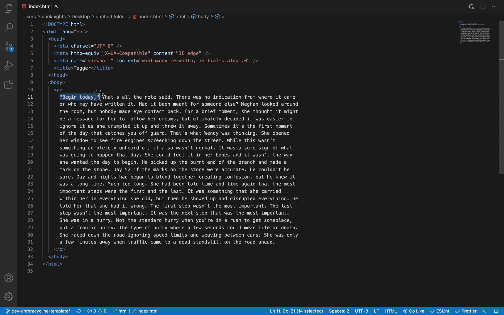

# Tagger

> Easily enclose any selection in HTML tags.


Just type <kbd>shift</kbd>+<kbd>alt</kbd>+<kbd>,</kbd> and enter your tag data in the prompt.

Follows the format `tag#id.class|attr="value"`.

Supports multiple selections:



---

## API

You can omit any value after `tag`, but existing tags must be in the correct order (id > class > attributes).

### `id`:

Only one `id` is allowed per tag. Any `#` character in `id`, `class` or `attributes` is allowed and won't render another `id`.

### `class`:

Classes can be chained:

```
div.class.another-class
```

Yields:

```html
<div class="class another-class"></div>
```

### Attributes:

Anything after the pipe character will be inserted as is:

```
div|anything can be added here
```

Yields:

```html
<div anything can be added here></div>
```
